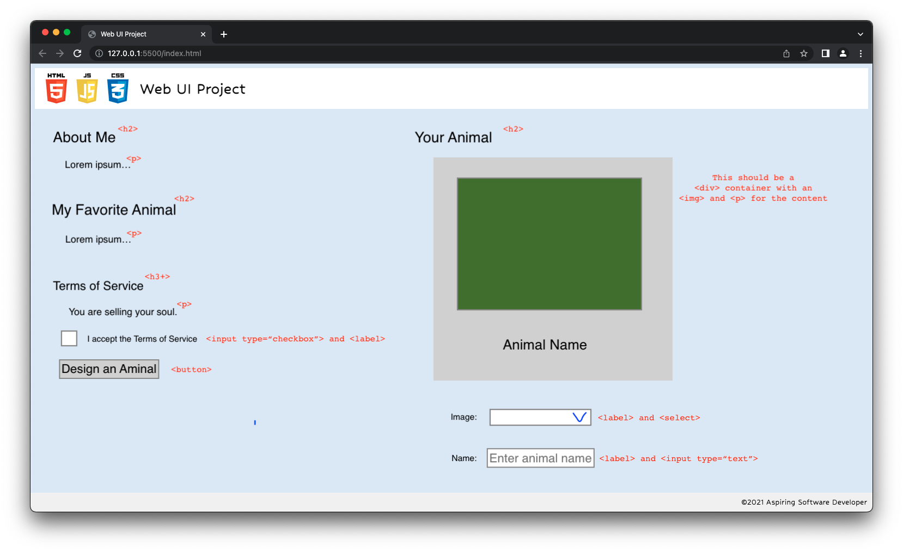

# About Me and My Favorite Animal (Dog)

## HTML Wireframe

The HTML will need four sections: an "About Me" section, a "My Favorite Animal" section, a section for the ToS, and section that lets the user design their dog. The last section will be hidden until the user checks a box to indicate their acceptance of the terms, which will enable a button the user can click to reveal the dog design app. The design app will then let the user select from a range of images and give the dog a name. It will present the user's dog back to them in a styled portrait frame of some description.

## State

1. ToS acceptance
    * Stored in checkbox `<input>` element state.
2. Design app revealed
    * Tied to user pressing button.
    * Stored in presence of `.hidden` class on app `<section>`.
3. Name input
    * Stored in `<input>` element state.
4. Image selection
    * Stored in `<select>` element state.

## Events

To react to state changes, we will need to use three events:

1. `click`: For when the user clicks the checkbox or button.
2. `change`: For when the user changes the image selection.
3. `input`: For when the user types in the dog name field.

---

# Original Prompt

## The Golden Rule:

🦸 🦸‍♂️ `Stop starting and start finishing.` 🏁

1. Limit Work in Progress (WIP)
1. Validate each line of code before moving forward
1. Keep it Simple Simon (KISS)

## Making a plan

1. Make a drawing of your app. **Simple "wireframes"**
1. Once you have a drawing, **name the HTML elements** you'll need to realize your vision**
1. For each HTML element ask: **Why do I need this?**
    - Does this element need **static content**, or is the content **dynamic state**?
    - If **state** where is the source of truth?
1. **Find all the 'events'** (user clicks, form submit, on load etc) in your app. Ask one by one, "What happens when" for each of these events. Does any state change?
1. Once we know the _why_ of elements, state, and events -- think about how to implement the "Why" as a "How"
1. Think about how to **validate each of your features** according to a Definition of Done
1. Consider what features **_depend_ on what other features**. Use this dependency logic to figure out what order to complete tasks.
